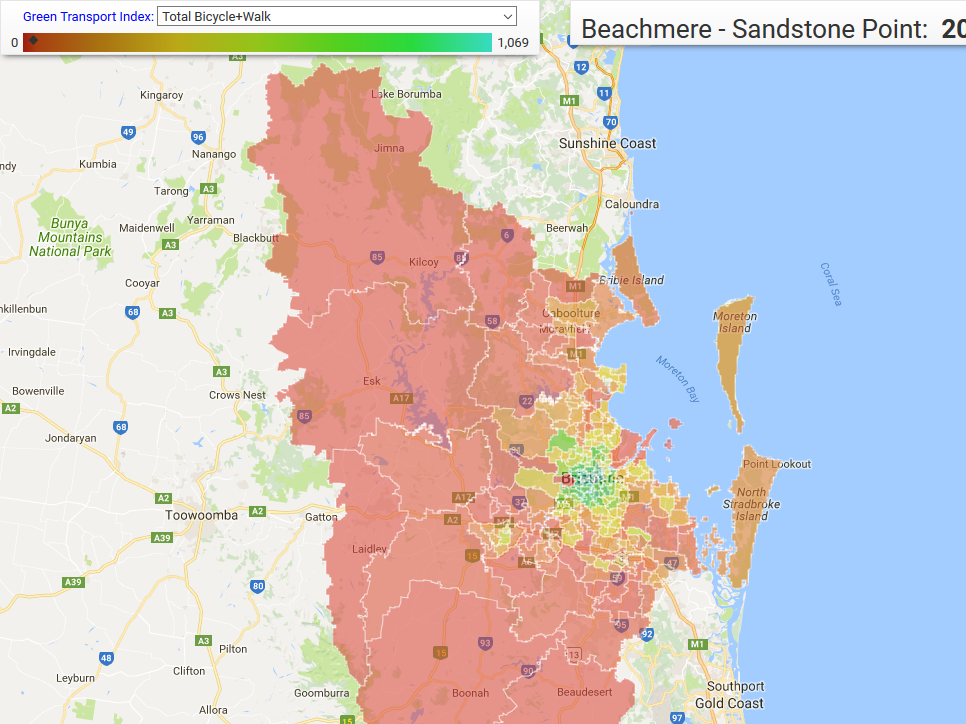

# UQUADIIndicator
This R package is used to access population mobility data of Urban Analytics Data Infrastructure (UADI) from UQ portal based on UQ eResearch RESTFUL Server

### What is this repository for? ###

This project contains R package  for accessing UADI indicators RESTFul server. 

After the code was built, just simple load the library.

For more details about JTW indicator, check out the latest version of "UQ UADI Indicator" document here:

http://www.itee.uq.edu.au/eresearch/projects/uadi/deliverables

### How to contact to authors? ###

Dr Guohun Zhu

Email:  guohun.zhu.phd@ieee.org
Address:    78-709      School of Information Technology and Electrical Engineering | The University of Queensland | Brisbane  QLD   4072,  AU
